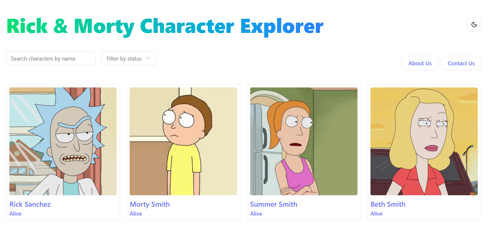
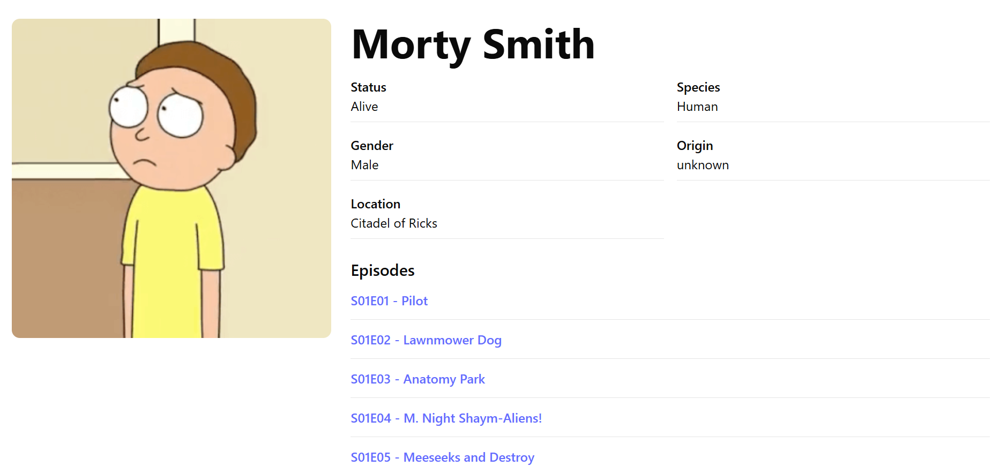
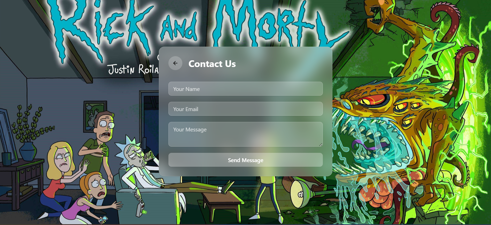
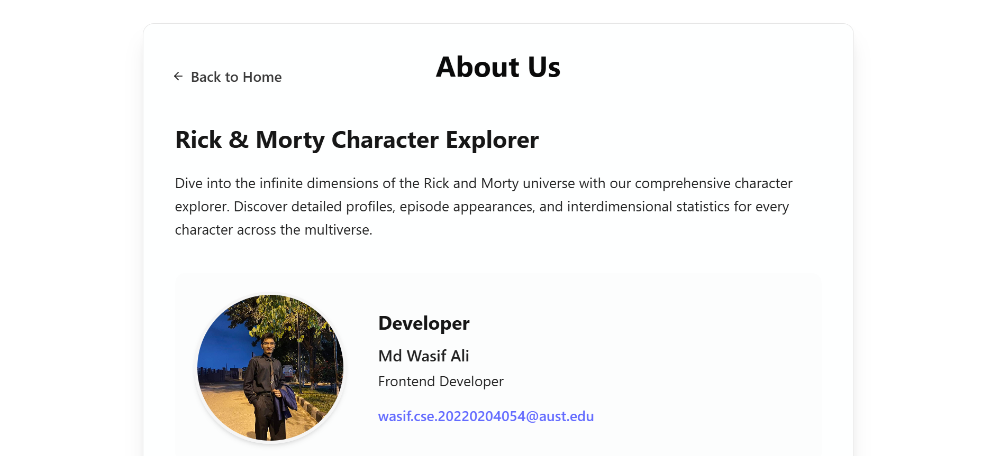
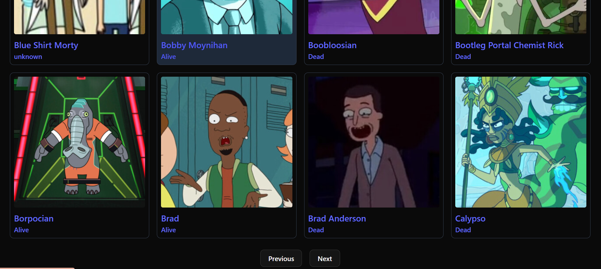
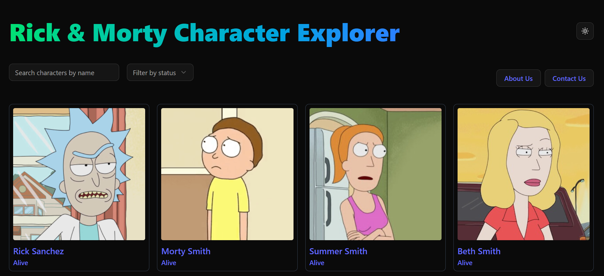
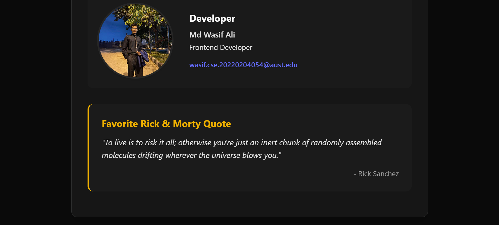

# CSE 3100: Web Application Development with DevOps

_Ahsanullah University of Science and Technology_  
**Fall 2024**

---
## Wakatime Badges

[](https://wakatime.com/badge/user/25bd1379-89ac-47c1-8743-d56b2288f599/project/ef66ad79-a9b8-47e0-810d-b3bd802cb5bd)


# Rick & Morty Explorer – Assignment 1

An interactive, responsive React app to explore characters from the Rick & Morty universe using the public Rick & Morty API. Built as part of the **Web Application Development with DevOps** course.

---

## 🚀 Features

### 🧪 Main Functionality
- 🔍 **Search & Filter** by character name and status (Alive, Dead, Unknown)
- 📄 **Character Details Page** with full information and episode titles
- 📄 **Pagination** with API-based previous/next navigation
- 📬 **Contact Us Page** with validation and success message
- ℹ️ **About Us Page** with app info, developer name, and favorite quote

### 💄 UI/UX
- Built using **React + Vite**
- Styled with **Tailwind CSS v4 + ShadCN UI**
- 🌗 **Dark/Light mode toggle**
- ✅ Responsive and accessible design

---

## 📦 Tech Stack

- React + Vite
- Tailwind CSS v4
- ShadCN UI (Component library)
- React Router
- Rick & Morty API (https://rickandmortyapi.com)

---

## 🔧 Setup Instructions

1. Clone the repo:
   ```bash
   git clone https://github.com/MdWasifAli99/cse-3100.git
   cd cse-3100
   git checkout assignment-1-20220204054
2. Install dependencies:

    npm install

3. Start the development server:
     
     npm run dev   


## 📊 Time Tracking

        Development time tracked using WakaTime

 ## 🤖 AI Usage

| Tool             | Purpose                                                                        |
| ---------------- | ------------------------------------------------------------------------------ |
| ChatGPT (GPT-4o) | Assisted in UI/UX design, dynamic routing, state logic, and ShadCN integration |
                              |
## ⚠️ Known Issues
Contact form has no backend storage (yet)

## 🖼️ Screenshots

### 🏠 Home Page


### 📄 Character Details


### 📬 Contact Us


## 📬 About Us


## Pagination


### 🌗 Dark Mode





