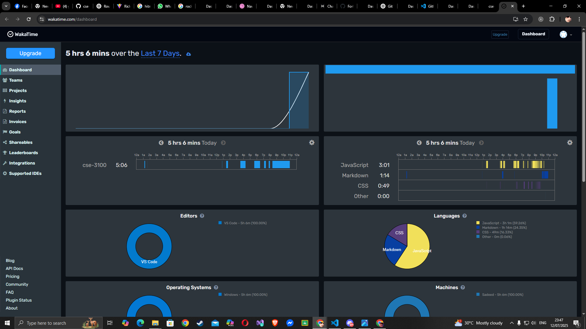
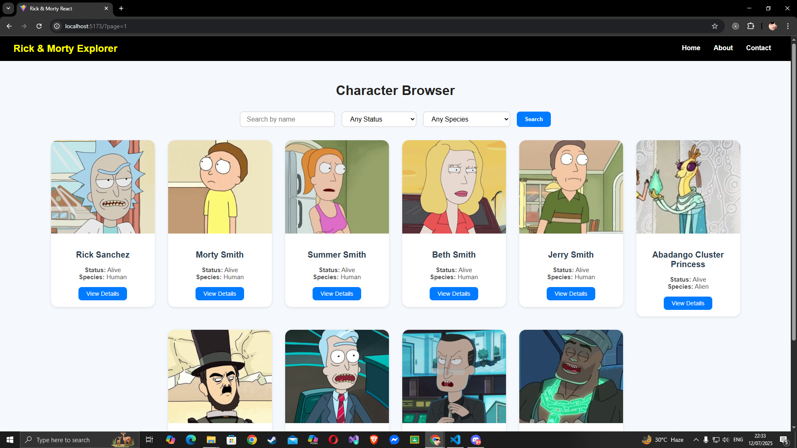
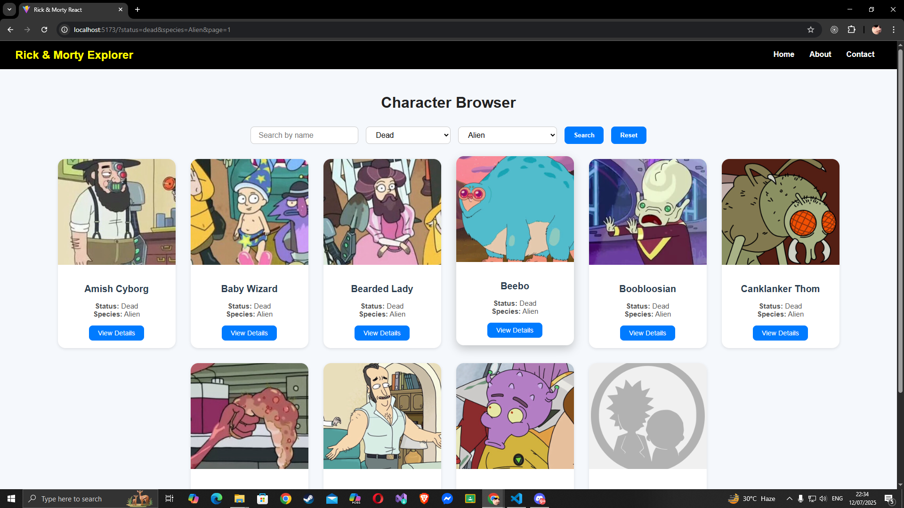
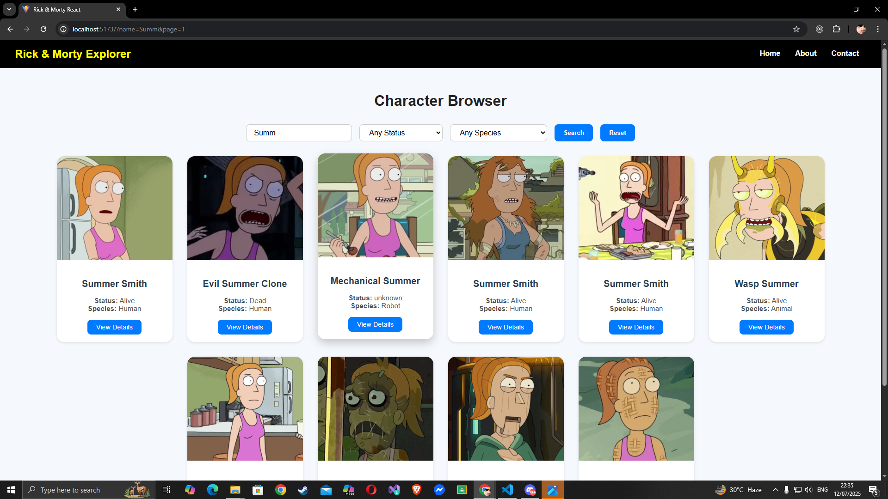
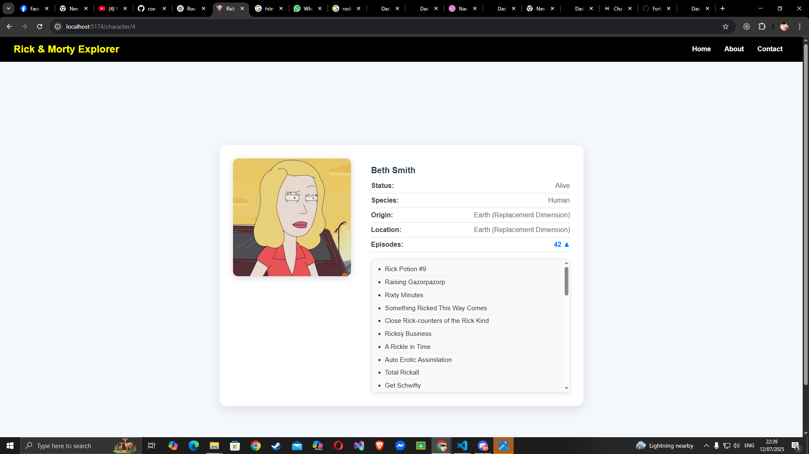
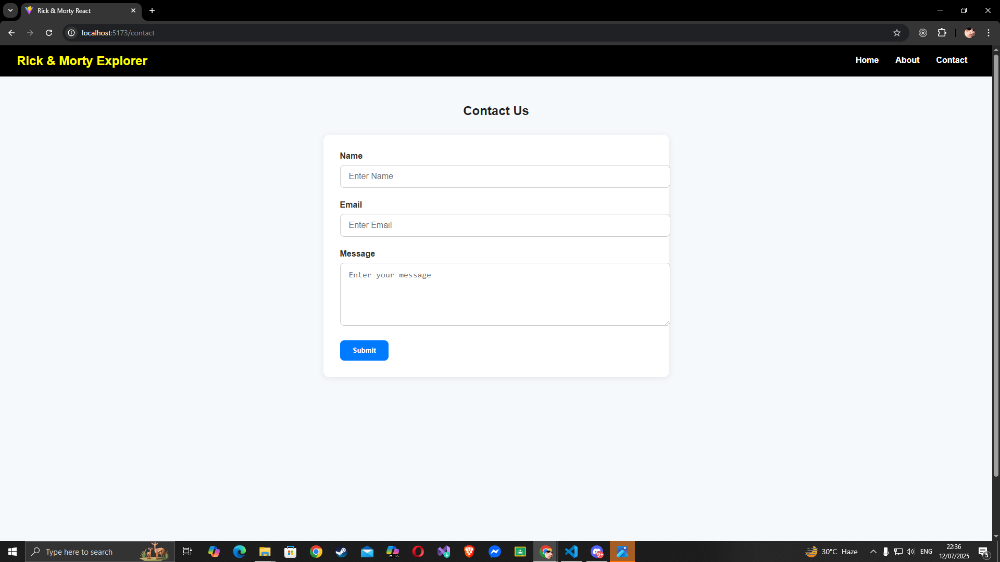
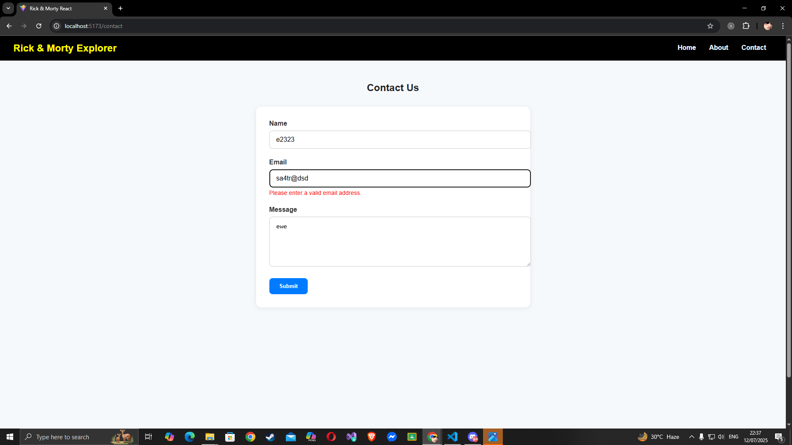
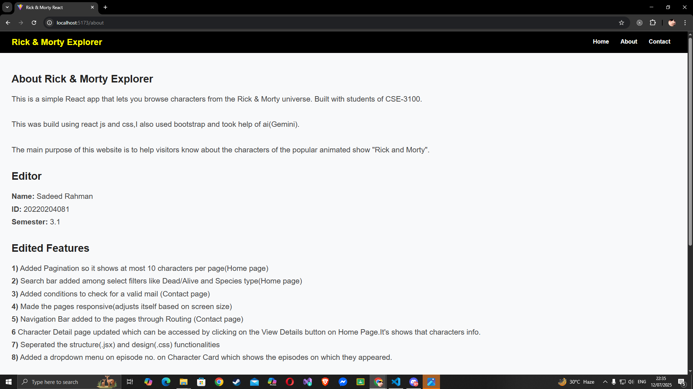
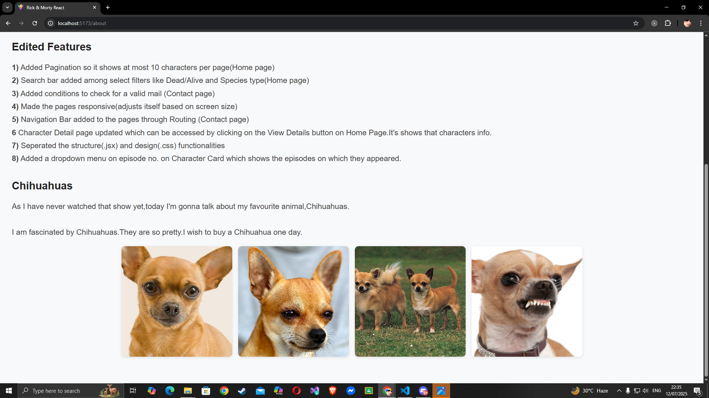

# Rick & Morty Explorer – Assignment 1

In this project, you'll build a beautiful and interactive single-page application that allows users to explore, filter, and view details about characters from the Rick and Morty universe using the public Rick and Morty API.

You'll apply React and JavaScript skills, routing, API fetching, conditional rendering, and basic UX design.

---

## Submission Guidelines

The following items are **strongly recommended** to ensure a professional, well-documented, and transparent submission (not directly assessed or graded):

- **Time Tracking (Recommended):**  
  Use tools like [WakaTime](https://wakatime.com/) to track your development time. This provides visibility into the effort invested.

- **Updated README (Mandatory):**  
  Include a clear and updated `README.md` in your repository with:

  - Summary of implemented features
  - Any additional improvements made
  - Setup and run instructions
  - Known issues or limitations
  - Notes for the instructor

- **AI Tool Usage (If Used):**  
  If you have used any AI-powered tools during development, please include:
  - A short description of which AI tool(s) were used
  - A brief explanation of how they were used

## Requirements

Make sure you have the following installed:

- [Node.js (preferably v22.16.5)](https://nodejs.org/en/download/)
- [Code editor – VSCode](https://code.visualstudio.com/)
- [NVM (optional)](https://github.com/coreybutler/nvm-windows)
- [WakaTime extension for VSCode (to track total time invested in this project)](https://wakatime.com/plugins/vscode)

---

## Waka Time

[](https://wakatime.com/badge/user/3764e15a-69bc-4b7d-ad15-f837a011962c/project/29a3fbbd-a9d6-46fc-8ef5-69736e6f0088)

## Works Done

- Added pagination so it shows at most 10 characters per page (Home page).
- Integrated a search bar along with dropdown filters like status (Dead/Alive) and species type (Home page).
- Implemented email validation in the Contact page form.
- Made all pages fully responsive across different screen sizes.
- Added a Navigation Bar and routed pages like Contact, About, and Character Details.
- Built a dynamic Character Detail page accessible via "View Details" on Home page, showing character-specific info.
- Separated structure (`.jsx`) and styling (`.css`) across all components and pages.
- Enhanced the Character Detail page with a dropdown on the episode count, showing the list of episodes the character appeared in.

- Created Router.jsx and moved the Routing segment to there to keep App.jsx clean<br><br>

<h1>Screenshots</h1>

## Waka Time

<br><br>

## Home Page

<br><br>

<h3>Using Search Filters</h3><br>




## Character Card

<br> A drop down menu is put on the Episode No.s row to see the episodes in which the character appeared<br><br>
<br><br>

## Contact Page

<br>
<br>

<h3>Mail parameters check</h3>
Puts error if invalid mail is put
<br><br>
<br>

## About Page




## Setup Instructions

### Clone the Repository

Fork the base repository. Then, clone the forked repository to your local machine and switch to the branch assignment-1

```bash
git clone git@github.com:parvez-ahammed/cse-3100.git
cd cse-3100
git checkout assignment-1
```

### Install Dependencies

Run the following to install npm dependencies

```bash
npm install
```

### Run the Development Server

```bash
npm run dev
```

---

## Assignment Instructions

You'll enhance the base Rick & Morty character explorer app with the following features and pages.

### 1. Character Details Page (2 marks)

On the main list, clicking a character should navigate to a dynamic route (e.g., /character/1) and display:

- Name
- Image
- Status
- Species
- Origin
- Last known location
- Number of episodes they appeared in

You must use React Router’s dynamic routing with the character ID.

### 2. Search + Filter Functionality (2 marks)

- Add a search box to filter characters by name.

- Add a dropdown to filter by status (Alive, Dead, Unknown).

- Filters must work together and persist in the URL via query parameters (e.g., ?name=rick&status=alive).

### 3. Pagination (2 marks)

- Use the API’s built-in pagination (?page=2) to add a “Next” and “Previous” button at the bottom.

- Show only 10 characters per page.

- Prevent going past first/last page.

### 4. Contact Us Page (2 marks)

Create a separate route /contact with a form that includes:

- Name
- Email
- Message
- Submit button
- Form validation (e.g., required fields, valid email format)
- On submit, display a success message and reset the form.

### 5. About Us Page (1 mark)

Static page /about with:

- Info about the app
- Developer
- Favorite Rick & Morty quote

### 6. Code Quality (1 mark)

- Clean code structure
- Reusable components (e.g., CharacterCard)
- Proper comments, meaningful names, formatting

---

## Bonus Challenges (Optional)

Not required but impressive if done:

- Add episode titles in the character detail view by fetching additional data
- Add a dark/light mode toggle
- Store search/filter preferences in localStorage

---

## API Reference

- List characters:  
  <https://rickandmortyapi.com/api/character>

- Search by name:  
  <https://rickandmortyapi.com/api/character/?name=rick>

- Filter by status:  
  <https://rickandmortyapi.com/api/character/?status>

## Recommeded Project Structure (Optional and Flexible)

To keep your project organized, consider the following structure:

- `src/assets`: Static assets (e.g., images, icons)
- `src/common`: Common utilities and constants (e.g., API endpoints, constants, apis)
- `src/components`: Reusable components (e.g., CharacterCard, SearchBar, FilterDropdown)
- `src/config`: Configuration files (e.g., API configuration or app settings)
- `src/context`: Context providers (e.g., ThemeContext, FilterContext)
- `src/features`: Feature-specific components (e.g., CharacterList, CharacterDetails, ContactForm)
- `src/pages`: Page components (e.g., HomePage, CharacterDetailsPage, ContactPage, AboutPage)
- `src/hooks`: Custom hooks (e.g., useFetchCharacters, useQueryParams)
- `src/utils`: Utility functions (e.g., formatCharacterData, validateEmail)
- `src/styles`: CSS files or styled components
- `src/routes`: Route definitions (e.g., AppRouter)
