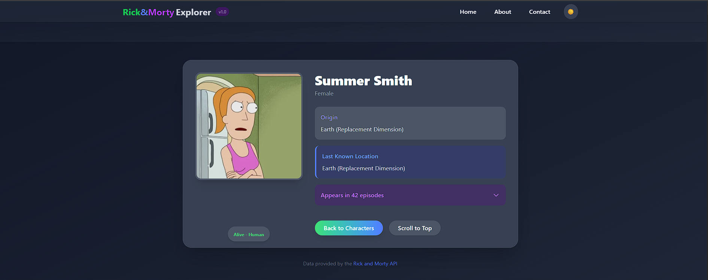

# Rick & Morty Explorer - Assignment 1

## Project Screenshots

<div align="center">
  <h3>Home Page with Character Listing</h3>
  
  <br/><br/>

  <h3>Home Page with Character Listing light mode</h3>
  
  <br/><br/>

  <h3>Character Details Page</h3>
  
  <br/><br/>

  <h3>Contact Form</h3>
  
  <br/><br/>

  <h3>About Page</h3>
  
</div>
A responsive React application that allows users to explore characters from the Rick & Morty universe using the public Rick & Morty API.

## Features Implemented

### Core Requirements

✅ **Character Details Page**

- Dynamic routing (e.g., /character/1)
- Displays comprehensive character information including:
  - Image, name, status, species
  - Origin and last known location
  - Episode count

✅ **Search & Filter Functionality**

- Name search with real-time filtering
- Status filter (Alive/Dead/Unknown)
- Combined filters with URL persistence

✅ **Pagination System**

- Next/Previous buttons
- 10 characters per page
- Boundary protection (can't go beyond first/last page)

✅ **Contact Us Page**

- Form with validation for:
  - Name (required)
  - Email (format validation)
  - Message (required)
- Success message on submission

✅ **About Us Page**

- App description
- Developer information
- Favorite Rick & Morty quote

✅ **Code Quality**

- Reusable components (CharacterCard, SearchBar)
- Clean folder structure
- Meaningful variable names
- Proper commenting

### Bonus Features Implemented

✨ **Dark/Light Mode Toggle**

- Full theme support across all pages
- Persists user preference in localStorage

✨ **Enhanced Animations**

- Smooth transitions between pages
- Loading states
- Interactive hover effects

## Development Details

### Technologies Used

- React.js
- React Router
- Tailwind CSS
- Rick & Morty API

### AI Tool Usage

I used the following AI tools during development:

**1. DeepSeek Chat**

- Assisted with debugging React state management issues
- Suggested optimizations for API fetching
- Helped design the responsive layout

**2. ChatGPT**

- Generated boilerplate code for form validation
- Provided Tailwind CSS class recommendations
- Suggested animation implementations

**Note:** All AI-generated code was reviewed, modified, and properly integrated into the project.

### Time Investment

[](https://wakatime.com/badge/user/9ed32cdc-f1b0-40d8-b67e-a2a820a8a845/project/a27bea73-af77-4ab5-885b-4058b0f397fa)

Total development time: ~6 hours

## Setup Instructions

### Prerequisites

- Node.js (v18+ recommended)
- npm or yarn

### Installation

1. Clone the repository:
   ```bash
   git clone git@github.com:parvez-ahammed/cse-3100.git
   cd cse-3100
   git checkout assignment-1
   ```
