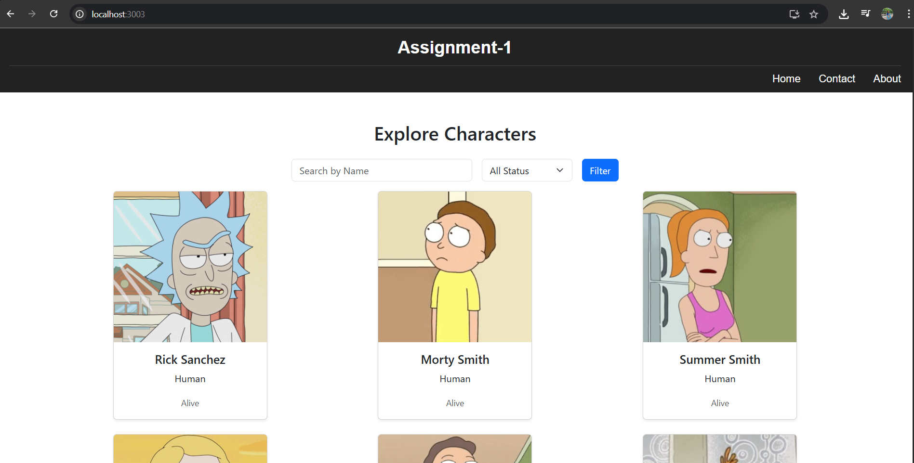
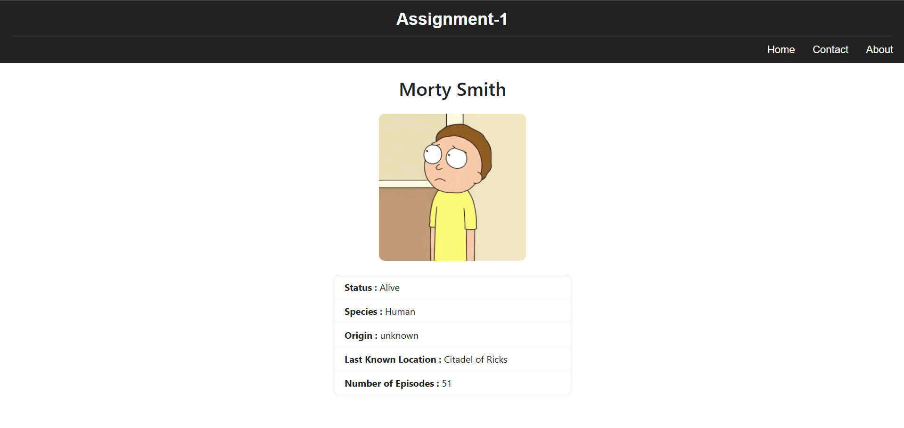
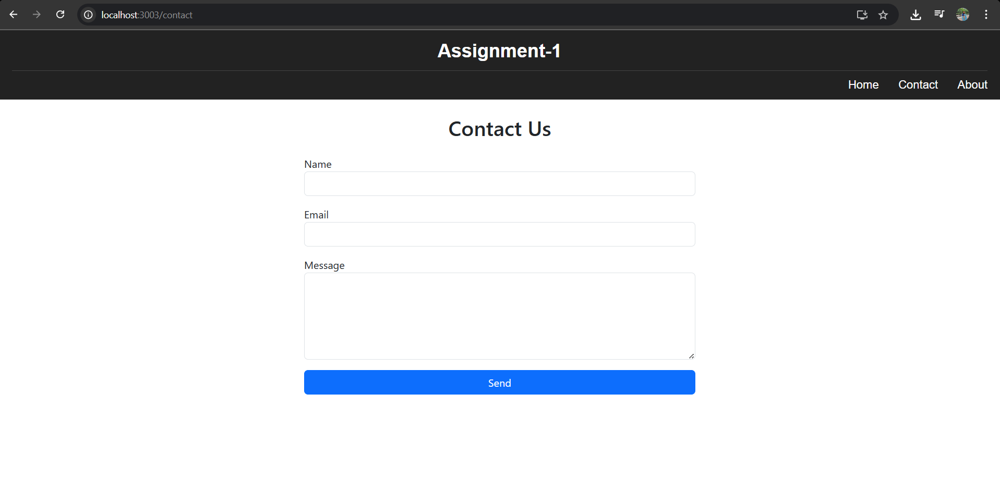
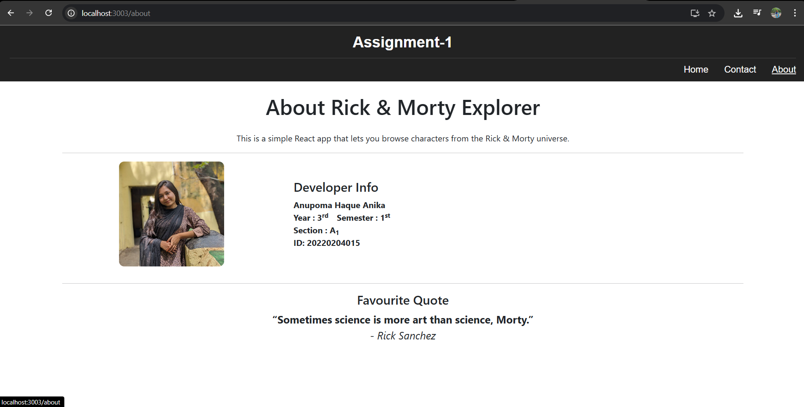
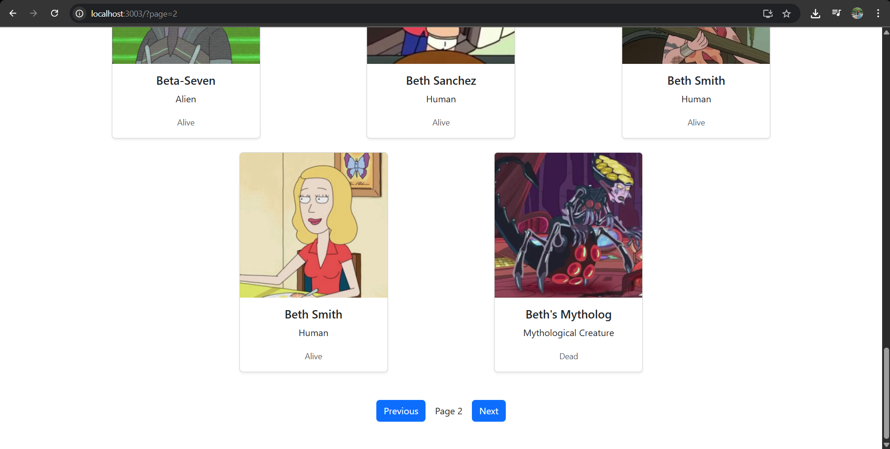

# Rick & Morty Explorer 

A beautiful and interative React single-page application to explore characters from the Rick and Morty universe. Built using the public Rick and Morty API. 

_____

## Features 

- Browse Rick and Morty characters with image and basic info. 
- Search characters by name. 
- Filter characters by status (Alive, Dead, Unknown).
- Pagination with Next and Previous buttons. 
- View detailed information for each character on a separate page. 
- Contact page with form validation. 
- About page with developer info and favorite quote. 
- Clean, centered layout with responsive design.

_____

## Screenshots 

### Home Page with Character List and Filters 

### Character Detail Page

### Contact Page with Form

### About Page

### Pagination 

_____

## Additional improvements made 

- Clean responsive layout using Bootstrap.
- Developer photo and styled about page.
- Centered card design with consistent spacing.

_____

## Setup and run instructions 

### Clone the repository 

'''bash 

git clone https://github.com/Anupoma-Haque/rick-morty-app.git

cd rick-morty-app

### Install dependencies 

npm install 

### Start the development server 

npm run dev 

_____

## Known issues or limitations 

- Currently no loading spinner while fetching data. 
- Pagination resets to first page after applying filter. 
- No error message shown for API failures. 

_____

## Notes for the instructor 

- Contact and About pages with proper routing
- The app was tested primarily on desktop screen sizes.
- Dynamic character details page.
- WakaTime was enabled to track development time.
- Screenshots of all pages have been provided under `/Screenshots` folder.

_____